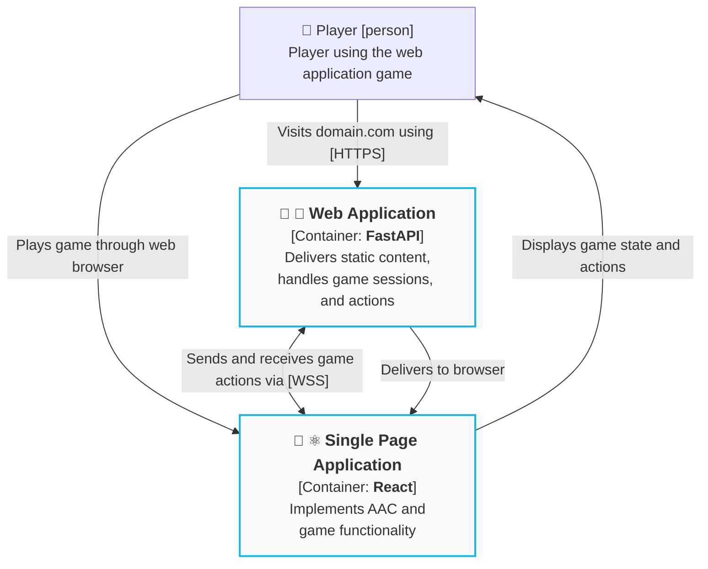

# System Block Diagram

## Web Application

Responsible for:

* Maintaining game session state, e.g. customer orders, completed orders, and player actions.
* Broadcasting game actions to all players. Actions done by one player are seen by others.

## Single Page Application

Game runs here. Responsible for:

* Implementing AAC functionality and letting it control the game actions.
* Implementing game logic and visuals. Game rules should not be validated.
* Game updates to **Web Application**.
