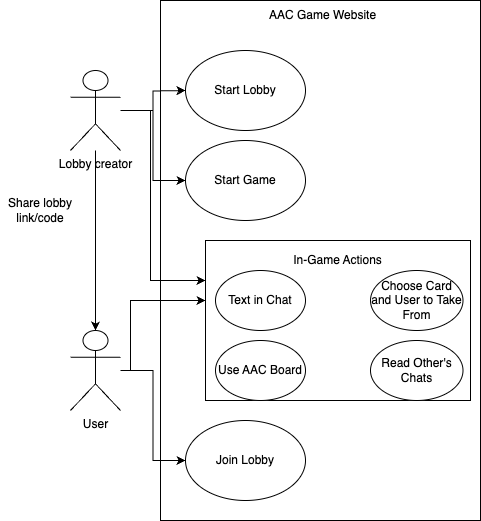

# Use Case Descriptions
## **Use Case 1 - Start a Lobby**
1. The user accesses the web application and sees the option to start or join a game.
2. The user clicks the "Start Lobby" button.
3. The user receives a unique game code.
4. The user copies the game code and shares it with friends.

## **Use Case 2 - Join a Lobby**
1. The user accesses the web application and sees the option to start or join a game.
2. The user clicks the "Join Game" button.
3. The user is taken to a new screen to enter the game code.
4. The user enters the game code provided by a friend.
5. The user clicks the "Join" button.
6. The user sees the lobby page.

## **Use Case 3 - Start a Game**
**Starts from:**
* [Use Case 1](#use-case-1---start-a-lobby).

1. The user sees a list of players who have joined the lobby.
2. The user clicks the "Start Game" button to begin the game.
3. The user is taken to the game board and sees their starting hand.

## **Use Case 4 - Lobby starts**
**Starts from:**
* [Use Case 2](#use-case-2---join-a-lobby).

1. The user sees a list of players who have joined the lobby.
2. The user waits for the lobby leader to click the "Start Game" button.
3. The user sees a message indicating that the game has started.
4. The user is taken to the game board and sees their starting hand.

## **Use Case 5 - Take a Card from a Player Successfully**
**Starts from:**
* [Use Case 3](#use-case-3---start-a-game).
* [Use Case 4](#use-case-4---be-in-a-lobby-that-started).
* [Use Case 5](#use-case-5---take-a-card-from-a-player-successfully).

1. The user sees that it is their turn to play.
2. The user clicks on a card in their own hand to select it.
3. The user clicks on another player’s cards to request the selected card.
4. The other player has one or more of the requested card(s).
5. The user sees all copies of the requested card(s) move from the other player’s hand to their own.
6. The user sees a message confirming the successful request, and their turn continues.

## **Use Case 6 - Take a Card from a Player and Fail ("Go Fish")**
**Starts from:**
* [Use Case 3](#use-case-3---start-a-game).
* [Use Case 4](#use-case-4---be-in-a-lobby-that-started).
* [Use Case 5](#use-case-5---take-a-card-from-a-player-successfully).

1. The user sees it is their turn.
2. The user clicks on a card in their own hand to select it.
3. The user clicks on another player’s cards to request that card.
4. The other player does not have the requested card.
5. The user sees and hears a "Go Fish" message.
6. The user receives a card from the deck if there are any.
7. If the user now has four of a kind - [Use Case 7](#use-case-7---place-a-four-of-a-kind-set-in-the-pool-automatically).
8. The user’s turn automatically ends.

## **Use Case 7 - Place a Four-of-a-Kind Set in the Pool Automatically**
**Starts from:**
* [Use Case 5](#use-case-5---take-a-card-from-a-player-successfully).
* [Use Case 6](#use-case-6---take-a-card-from-a-player-and-fail-go-fish).

1. The user collects four matching cards in their hand.
2. The four matching cards automatically move to the pool.
3. The user sees their completed set displayed on the board.
4. The user sees a message confirming the completed set.

## **Use Case 8 - Run Out of Cards and Draw More**

1. The user puts down a set or gets cards taken from them and has an empty hand.
2. The user immediately and automatically draws upto 3 cards from the deck.

## **Use Case 9 - Use Game Text Chat**
1. The user clicks the "Chat" button.
2. The user types a message in the chat input box.
3. The user clicks the send button.
4. The user sees their message appear in the chat window.

## **Use Case 10 - Receive Message in Game Text Chat**
1. The user clicks the "Chat" button.
2. The user sees previously sent messages.
3. The user sees an indicator someone else is typing.
4. The user sees someone else's message appear in the chat window.

## **Use Case 11 - Use the AAC Menu**
1. The user clicks the "AAC Menu" button.
2. The user selects a phrase or word from the menu.
3. The user sees the selected phrase appear in the chat.
4. The user hears the phrase read aloud.

## **Use Case 12 - Receive AAC Communication**
1. The user receives AAC communication.
2. The user sees the phrase or word displayed in the chat.
3. The user hears the phrase or word read out loud.

## **Use Case 13 - Win the Game**
**Starts from:**
* [Use Case 7](#use-case-7---place-a-four-of-a-kind-set-in-the-pool-automatically).

1. The user places their second four-of-a-kind set in the pool.
2. The user sees a message indicating they won.
3. The user sees the game end.

## **Use Case Diagram**

