# Use Case Sequences
## **Use Case 1 - Start a Lobby**

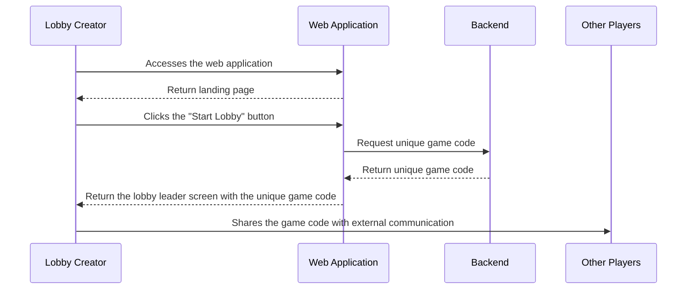

## **Use Case 2 - Join a Lobby**

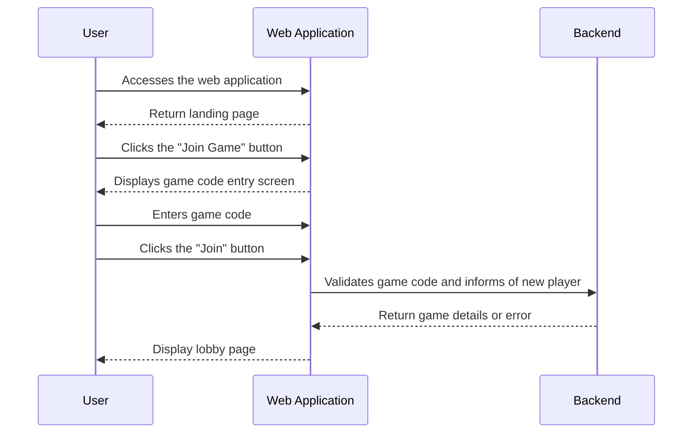

## **Use Case 3 - Start a Game**

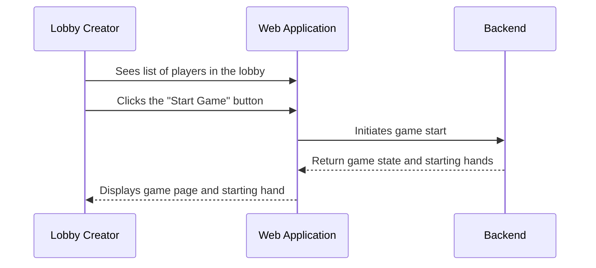

## **Use Case 4 - Lobby starts**

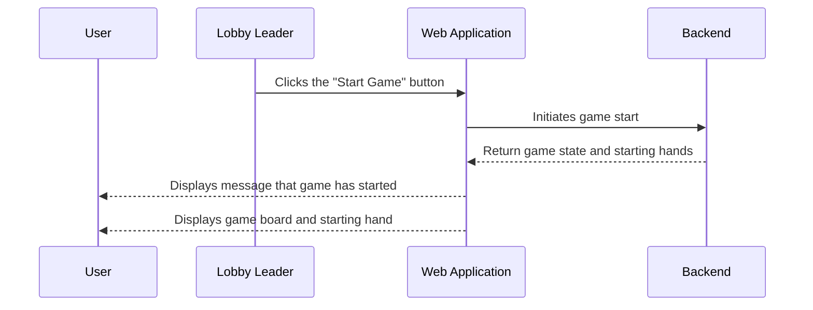
## **Use Case 5 - Take a Card from a Player Successfully**

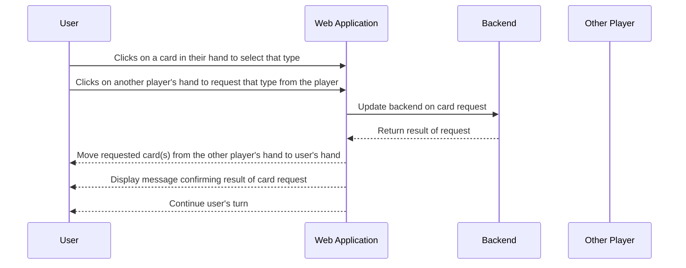
## **Use Case 6 - Take a Card from a Player and Fail ("Go Fish")**

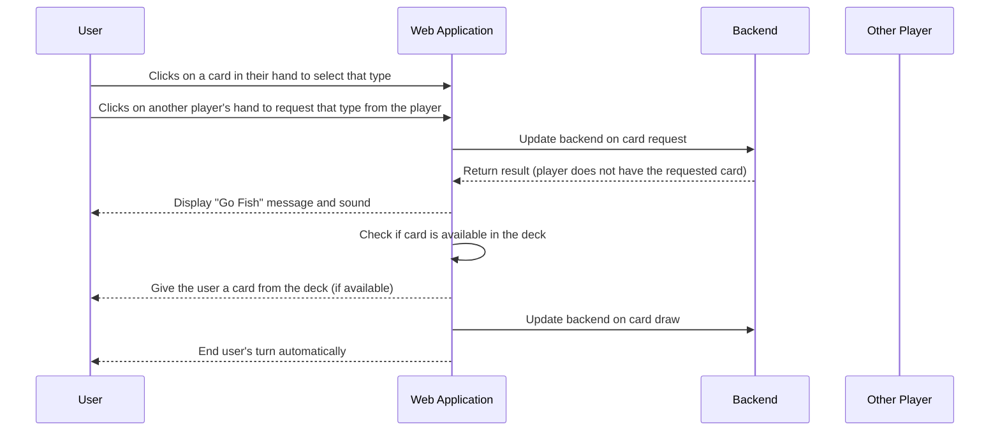

## **Use Case 7 - Place a Four-of-a-Kind Set in the Pool Automatically**

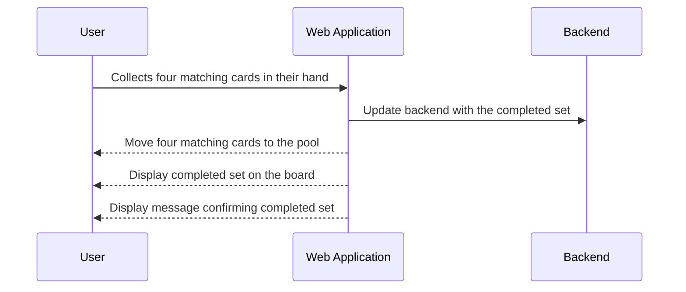

## **Use Case 8 - Run Out of Cards and Draw More**

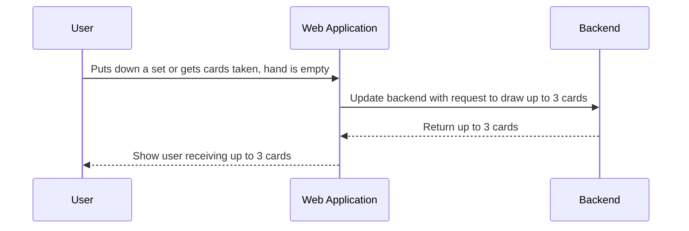

## **Use Case 9 - Use Game Text Chat**

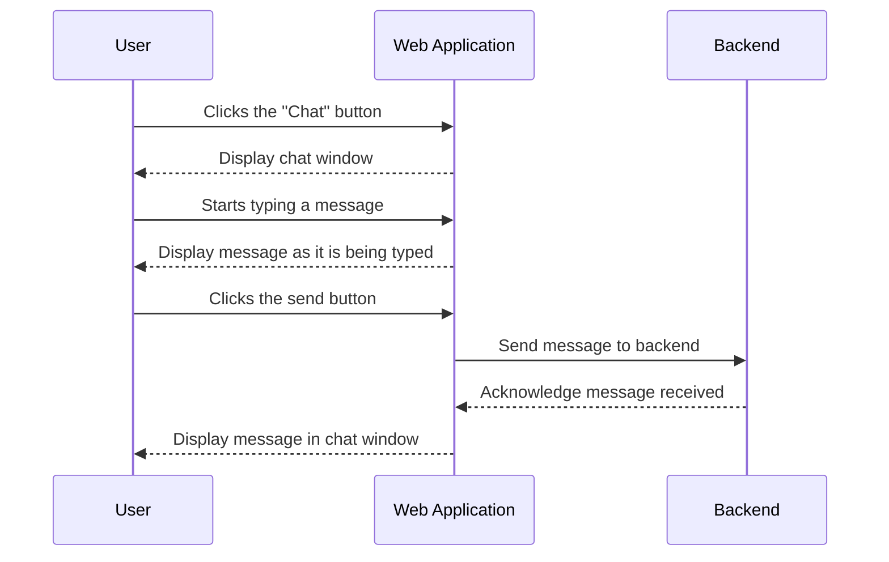

## **Use Case 10 - Receive Message in Game Text Chat**

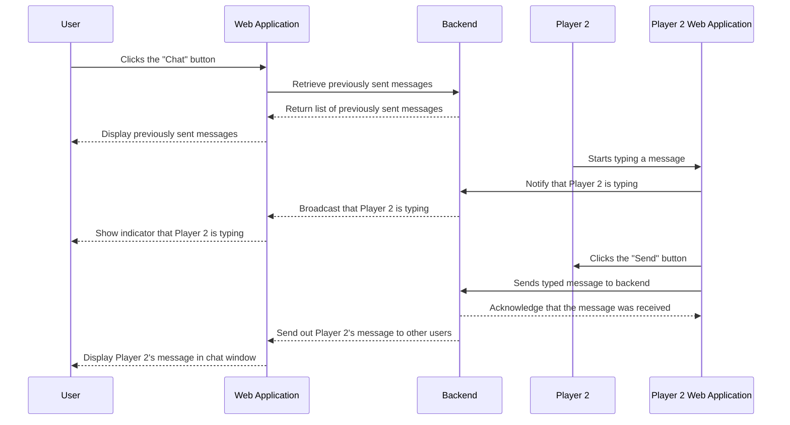

## **Use Case 11 - Use the AAC Menu**

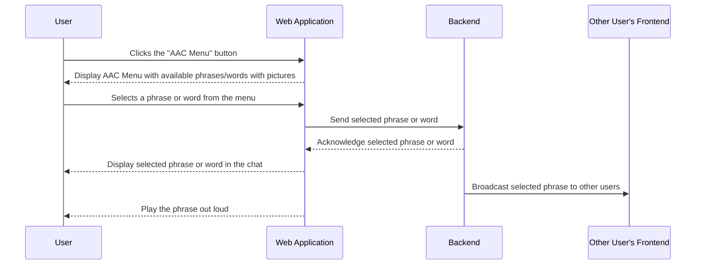

## **Use Case 12 - Receive AAC Communication**

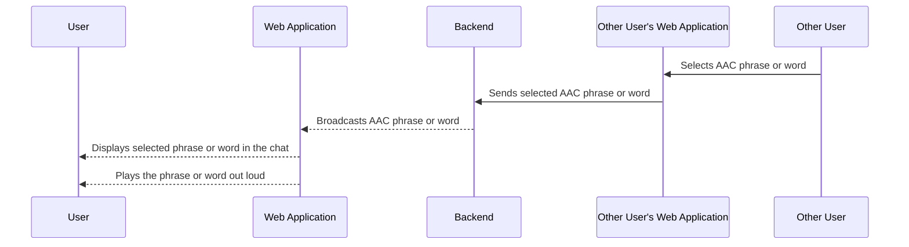

## **Use Case 13 - Win the Game**

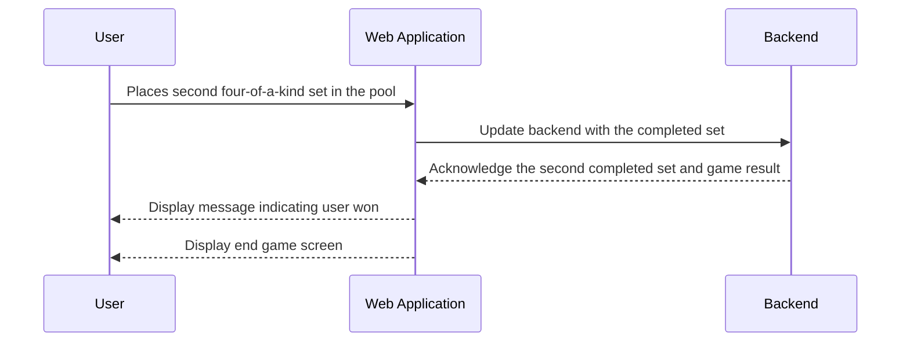

